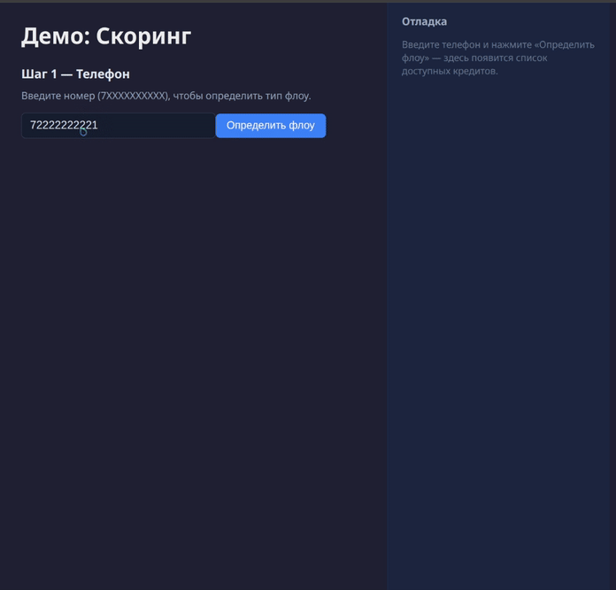

# Скоринг кредитных заявок

Асинхронная микросервисная система, принимающая кредитные заявки,
выполняющая антифрод-проверки и рассчитывающая решение по заявке.

Проект разработан в рамках курса от компании Koronatech с регулярным code review и обратной связью.

---

## Что делает
- Определяет тип клиента (pioneer / repeater) по номеру телефона.
- Выполняет антифрод-проверки + лимиты количества заявок.
- Рассчитывает скоринг и принимает решение по продукту.
- Хранит профили и историю заявок (PostgreSQL, события Kafka).

---

## Стек

| Часть | Технологии |
|-------|------------|
| Основа | FastAPI, asyncio |
| Данные | PostgreSQL (SQLAlchemy), Kafka, Redis |
| Инфраструктура | Docker Compose, Kubernetes+Helm |
| Тестирование | pytest (unit, integration)|
| CI/CD | GitLab CI |
| Метрики|  OpenTelemetry, Prometheus, Grafana |
| Организация проекта | Poetry, Mypy, Ruff |
| Frontend (AI generated) | React, TypeScript, Vite |

Во время курса сервисы разворачивались в облаке с помощью Kubernetes+Helm.

---

## Архитектура

```
[Frontend]
   │
   ├─> flow-service ──> Redis / data-service
   │
   └─> scoring-service
           │
           ├─> antifraud-service ──> Redis / data-service
           │
           └─> Kafka ──> data-service ──> PostgreSQL

```

- **flow-service** — определение типа клиента и доступных продуктов (Redis).
- **scoring-service** — обработка заявки, скоринг, публикация события в kafka.
- **antifraud-service** — антифрод-правила и лимиты заявок.
- **data-service** — профили клиентов и история заявок.

---

---
## Запуск

**Требования:** Docker и Docker Compose.

1. Из корня проекта:
   ```bash
   docker compose up -d
   ```
   При нестабильной работе data-service (рестарты) требуется перезапуск Kafka - `docker compose restart kafka`

2. Демо-интерфейс доступен на **http://localhost:3000**

---

## Тестовые данные

- **Pioneer** — продукты для нового клиента: QuickMoney, MicroLoan, ConsumerLoan.
- **Repeater** — продукты для повторного: LoyaltyLoan, AdvantagePlus, PrimeCredit.

Телефон: 11 цифр, начинается с 7 (например `79001234567`). Несуществующий номер - pioneer, уже сохранённый в БД - repeater (после хотя бы одной успешной заявки через скоринг).

---

Подробности по каждому сервису — в `README.md` и `CONTRIBUTING.md` внутри папок.
